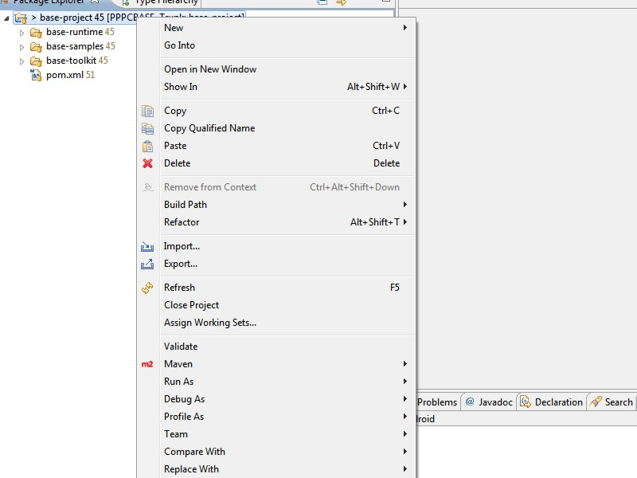

#Build Instructions

##Introduction

To simplify the usage of BASE and to reduce the number of libraries that we need to ship with the source code, we are using [Maven](http://maven.apache.org) to build BASE in a platform- and IDE-agnostic way. Furthermore, we are using [Subversion](http://subversion.tigris.org/) for source code management. Note that this page is not intended to be a primer on Maven or Subversion. If you want to learn more about Maven, you can read [this free book](http://www.sonatype.com/Support/Books/Maven-The-Complete-Reference), for example. For Subversion, you can read [this free book](http://svnbook.red-bean.com/index.en.html) which is not only comprehensive but also amusing, at times.

##Getting the Sources

Assuming that you have already installed a [Subversion client](http://subversion.tigris.org), a [Java SE SDK](http://www.oracle.com/technetwork/java/javase/downloads/index.html) as well as [Maven](http://maven.apache.org) or an IDE-specific Maven plug-in such as [m2eclipse](http://m2eclipse.sonatype.org/) for [Eclipse](http://www.eclipse.org), you can simply checkout the [base-project](http://pppc-base.googlecode.com/svn/code/trunk/base-project) from the trunk folder in the SVN. This will give you the latest development snaphot. Alternatively, you can also checkout one of the tagged versions from the [tags directory](http://pppc-base.googlecode.com/svn/code/tags). 

##Getting more SDKs

Due to its modular structure, BASE supports a number of platforms and we have used it to build applications on various types of devices such as SunSPOTs, OpenWRT routers, PCs and mobile devices running WM6, Android, Symbian, etc. This has resulted in a number of platform-specific plug-ins that are included in the source code. In order to build these plug-ins and the associated examples, you need to download and install the following SDKs:

 * The [SunSPOT SDK](http://www.sunspotworld.com/SPOTManager/) for SunSPOT related plug-ins.
 * The [Android SDK](http://developer.android.com/sdk/index.html) for Android related plug-ins.

If you do not want to use these platforms, you can simply comment out the modules that do not compile. This will not affect your ability to develop executable code for other platforms.

##Setting the Variables

Once you have installed the SDKs, you need to set the *sunspot.sdk.path* and the *android.sdk.path* variables in the topmost Maven pom. If you do not want to manipulate the pom, e.g. because you want to commit the changes back to the source tree later on, you can set the variables in your local settings.xml file which is usually located in a directory called .m2 under your home directory. To do this, just add the following code:

```
<settings xmlns="http://maven.apache.org/SETTINGS/1.0.0"
  xmlns:xsi="http://www.w3.org/2001/XMLSchema-instance"
  xsi:schemaLocation="http://maven.apache.org/SETTINGS/1.0.0
                      http://maven.apache.org/xsd/settings-1.0.0.xsd">
  <profiles>
    <profile>
      <id>pppc-base.googlecode.com</id>
      <properties>
        <!-- Path to the sunspot sdk (tested with yellow) -->
        <sunspot.sdk.path>C:/Progra~1/Java/Sunspot</sunspot.sdk.path>
        <!-- Path to the android sdk (requires 2.1-r1 Eclair). -->
        <android.sdk.path>C:/Progra~1/Java/Android</android.sdk.path>
      </properties>
    </profile>
  </profiles>
  <activeProfiles>
    <activeProfile>pppc-base.googlecode.com</activeProfile>
  </activeProfiles>
</settings>
```
 
##Building the Code

Once you have configured the variables, you should be able to build the code from the command line, for example, by running `mvn clean install`. This should build all modules and install them in your local repository. Note that this will also build the Eclipse plug-in which can be used to generate stubs from Java interfaces. Thereby, the tycho plug-in will download all required code from the Eclipse download site which can take a long time to complete. If you are not working on the Eclipse plug-in, you might want to comment out the *base-tool-eclipse* module which will significantly speed up your build.

##Coding with Eclipse

Assuming that you do not want to program with notepad, below some additional instructions on using Eclipse. To checkout and build the code directly with Eclipse, you need to install a Subversion plug-in such as [Subversive](http://www.eclipse.org/subversive/), an SVN connector for which you will be prompted after installing Subversive as well as [m2eclipse](http://m2eclipse.sonatype.org/). Once you have done this, go to the SVN repository view add <b>http://pppc-base.googlecode.com/svn</b> as repository location. Thereafter, go to *code/trunk* or *code/tags* and checkout the *base-project* folder as a project. 

To actually manipulate and build the code, you first need to materialize the projects. To do this, right-click the project and select "Import". 


<p align=center>*Figure 1: Eclipse Import Option*</p>

From the list, the materialize projects option which you can find in the Maven folder.


<p align=center>*Figure 2: Materialize Maven Project Option*</p>

Now click through the wizard, by hitting next a couple of times until you can click finish. This will bring up a screen to select the projects. Hit the browse button and select the *base-project* folder.
Now, select the projects that you want to manipulate or just hit finish to materialize all.


<p align=center>*Figure 3: Selected Maven Projects Dialog*</p>

Once this is done, you should see the materialized projects in the project view and you should be able to manipulate, build and run most of them. The only two projects that will require you to take further steps are the *base-ui-android* project as well as the *base-tool-eclipse* project. In order to work on those project you will have to add the Eclipse PDE and the Android project nature, respectively. 


<p align=center>*Figure 4: Successfully Imported Maven Modules*</p>

Now you should be able to use the run-as-maven dialog to execute Maven goals on the projects. Alternatively, you can simply use the auto-build feature on your projects. That's all, have fun.


 


