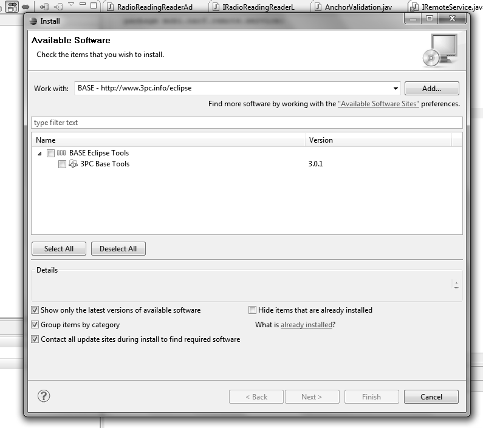
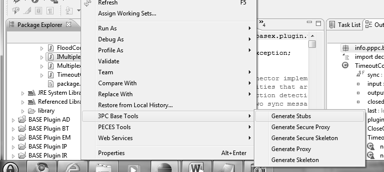

#Eclipse integration.

##Introduction

To simplify application development, BASE ships with a number of code generators that integrate into Eclipse as a plug-in. The Eclipse plug-in can generate stub objects (i.e. proxies and skeletons) from interface descriptions.

##Installation

You can install the BASE Eclipse plug-in just like any other plug-in by adding the following update site to Eclipse:

  `http://www.3pc.info/eclipse`

To do this, open Eclipse and choose *Help->Install New Software...*. Press the *Add...* button on the wizard page to add the above location. Choose the location, select the BASE plug-in and finish the wizard.

*Figure 1: Eclipse Plug-in Installation*

##Usage

Once the Eclipse plug-in is installed, you can generate proxies and skeletons from Java interfaces. To do this, right-click the interface in Eclipse's package explorer. Select *3PC BASE Tools* and choose the type of stub that you want to generate.

*Figure 2: Eclipse Plug-in Usage*

Note that each type of stub object can be generated in a normal and a secure variant. The secure variant introduces a dependency to the *base-core-security* project. A generated secure proxy automatically enforces authentic and secret communication. A generated secure skeleton can be used to verify the source of a call and to determine whether the interaction has been encrypted.
